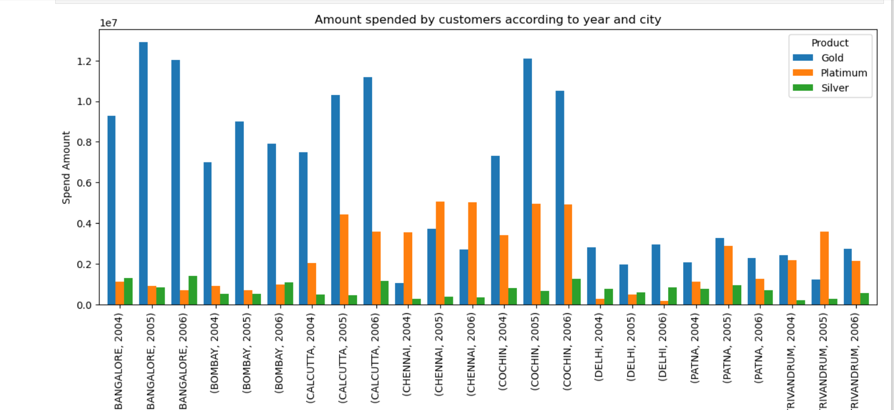
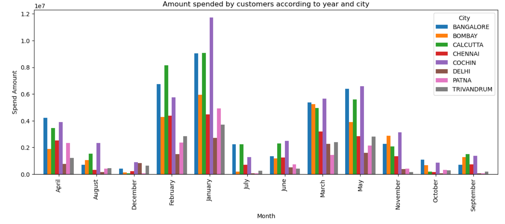
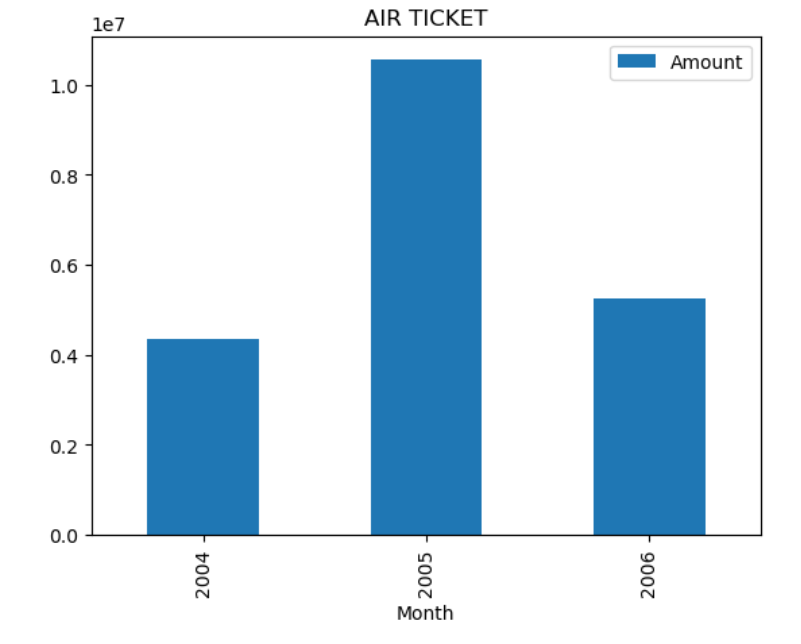
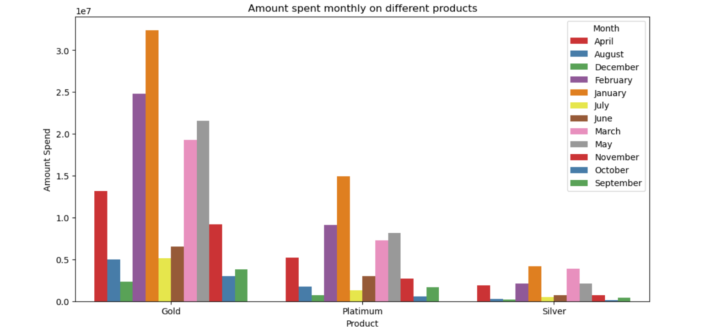

# 💳 Credit Card Data Analysis – Python Case Study

This project involves exploratory data analysis (EDA) of customer behavior, spending, and repayment patterns using a credit card dataset provided by a financial institution.

---

## 📌 Project Objective

- Analyze customer acquisition, spend behavior, and repayment patterns.
- Understand which segments contribute most to revenue and risk.
- Derive business insights for strategic decisions like credit limits and collections.

---

## 📊 Key Questions Answered

- What are the trends in monthly spending and repayments?
- Which customers are high-value or high-risk?
- How do different customer segments (age, income, gender) behave?

---

## 🛠️ Tools & Technologies

- **Python**: Data processing & analysis  
- **Pandas & NumPy**: Data wrangling  
- **Matplotlib & Seaborn**: Visualizations  
- **Jupyter Notebook**: Code & documentation

---


## 📂 Project Structure

```
Credit Card Case Study Python/
├── Credit Card Data.xlsx
├── Customer Acqusition.csv
├── Repayment.csv
├── spend.csv
├── Credit card case study.ipynb

```
---

## 🚀 How to Run

1. Load `Credit card case study.ipynb` in Jupyter.
2. Run the notebook step-by-step.

---

## 🧠 Key Findings

- Most repayments were below the due amount.
- Highest spend observed in Electronics and Travel.
- Male customers spent more in total than females.

---

## 🚀 How to Run This Project

1. **Clone the repo** or download the ZIP.
2. Open `Credit card case study.ipynb` using **Jupyter Notebook** or **VSCode**.
3. Ensure all required files (`CSV` or `Excel`) are in the same folder as the notebook.
4. Run each cell sequentially to explore the data, perform analysis, and view visualizations.

---

## 🧠 Key Insights

- A large portion of users **underpay their monthly dues**.
- Spending is **highest among middle-aged, high-income customers**.
- **Travel and Electronics** are the most popular spending categories.
- **Males spend more** than females overall, but show **less repayment consistency**.

---

## 📌 Business Impact

- Segmented customers into **low-risk, high-risk, and high-value clusters**.
- Identified **revenue leakage** from low repayment ratios.
- Suggested **credit policy adjustments** based on behavioral and demographic patterns.

---


## 📈 Sample Visuals

To include visual proof of your results , save a screenshot and place it in an `outputs/` folder:










## 📌 Author

**Abhishek Bhardwaj** 
  
[LinkedIn](https://www.linkedin.com/in/abhishekbhardwaj28)
[GitHub](https://github.com/abhishek-9617)

